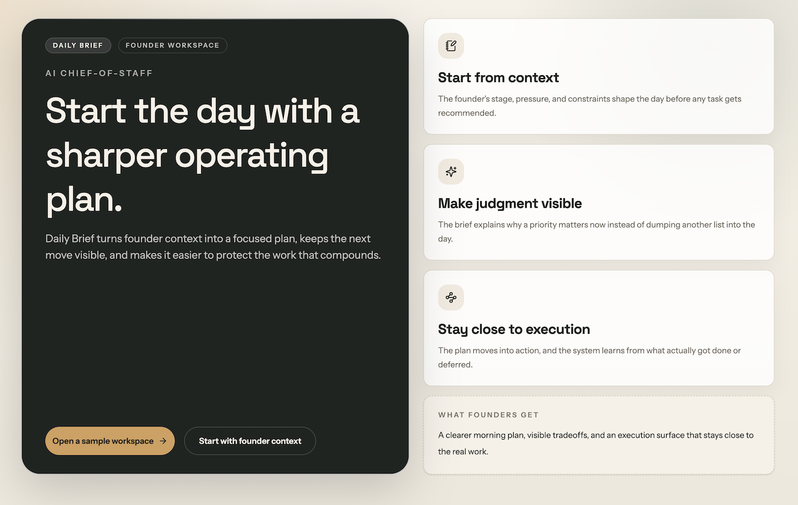
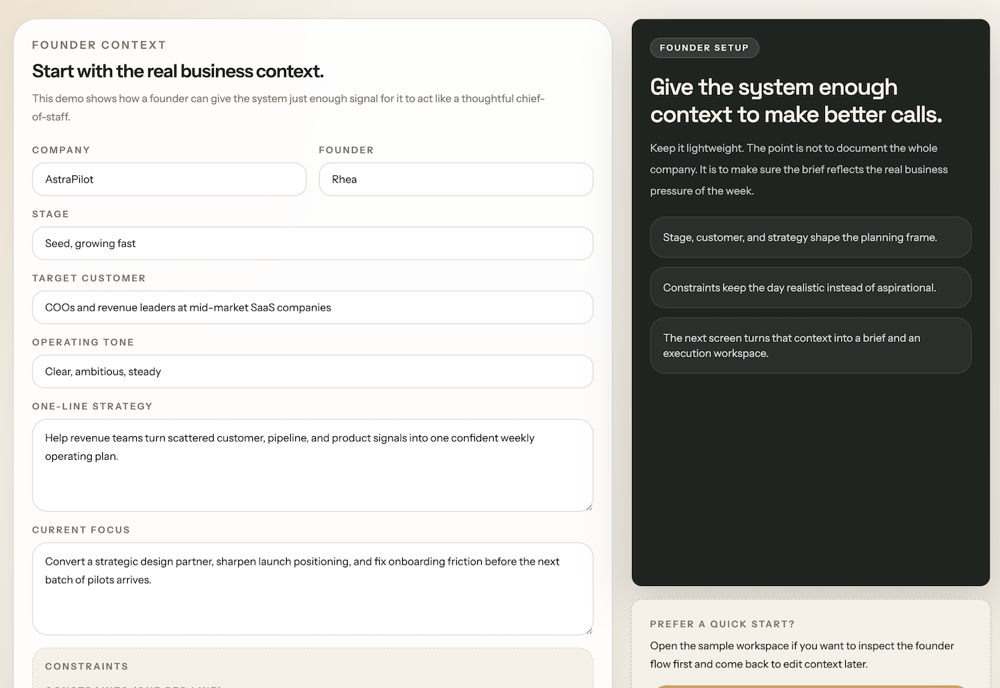
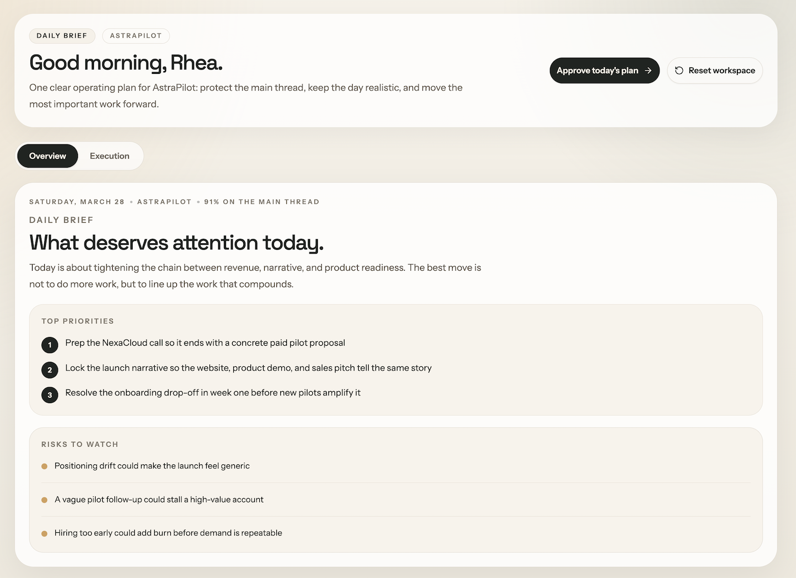
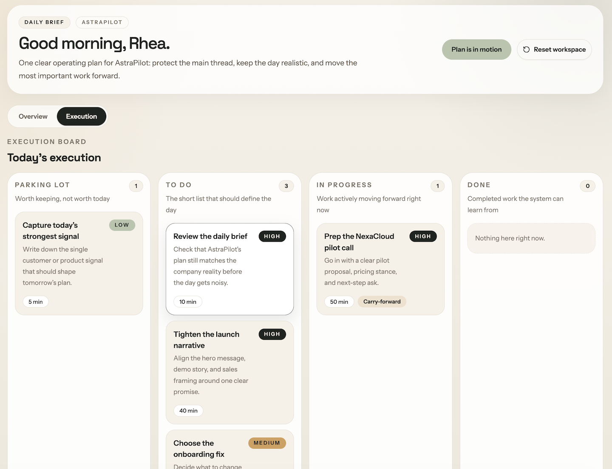
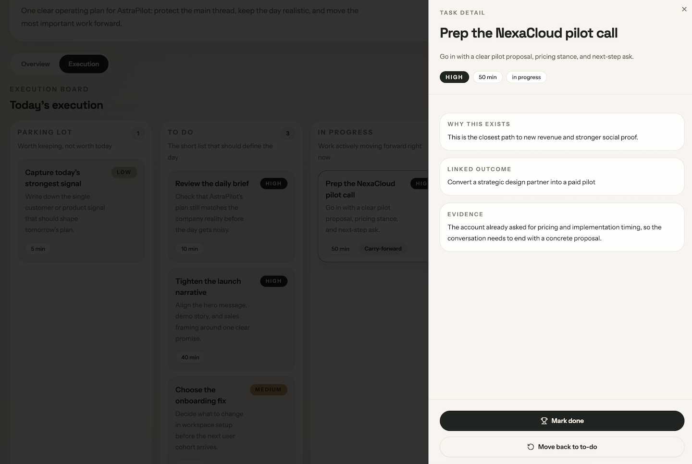
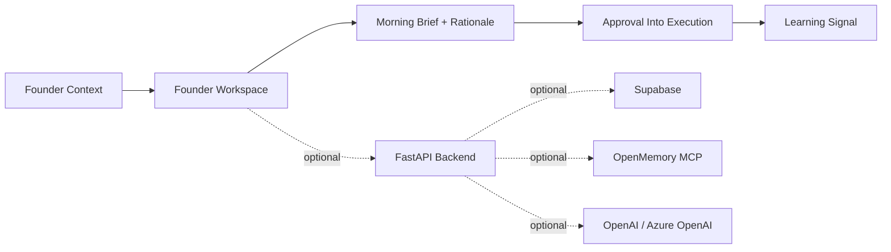

# Daily Brief

Daily Brief is an AI chief-of-staff for startup founders. It turns company context, constraints, and momentum into a clear operating plan for the day.

Founders already do this work manually: absorb signal, decide what matters, protect focus, and adjust when reality changes. Daily Brief is built around that loop.

This repo ships with a seeded founder workspace so you can explore the product without wiring up infrastructure first.

## What It Does

- Starts from founder context instead of a blank chat box
- Generates a concise morning brief with priorities, rationale, and risks
- Lets the founder approve the plan before it becomes an execution board
- Carries reasoning into task detail so work stays connected to outcomes
- Captures lightweight learning signals that should improve tomorrow's plan

## How Founders Use It

1. Add the company context that matters right now.
2. Review the morning brief and pressure-test the priorities.
3. Approve the plan and move into execution.
4. Update tasks as the day moves and keep the learning loop tight.

## Product Tour

### Landing

The opening screen keeps the promise simple: get to a clearer operating plan before the day gets noisy.



### Founder Context

The workflow starts from business reality: company stage, customer, strategy, and constraints.



### Morning Brief

The overview is meant to feel like a strong founder check-in, not another dashboard.



### Execution Board

Once the plan is approved, priorities move into a compact execution board that stays easy to scan.



### Task Detail

Task detail stays on demand so the workspace keeps its breathing room while the reasoning stays accessible.



## Run It Locally

### Frontend

```bash
cd frontend
corepack enable
yarn install
yarn dev
```

The frontend opens into a seeded founder workspace with no credentials required.

### Backend

If you already use the `daily-brief` Conda environment:

```bash
conda run -n daily-brief python -m pip install -r backend/requirements.txt
conda run -n daily-brief uvicorn backend.main:app --reload --host 0.0.0.0 --port 8000
```

Or with a plain virtualenv:

```bash
python -m venv .venv
. .venv/bin/activate
pip install -r backend/requirements.txt
uvicorn backend.main:app --reload --host 0.0.0.0 --port 8000
```

## Verification

Run the public release checks with:

```bash
./scripts/verify-public-release.sh
```

That covers:

- frontend lint
- frontend build
- backend tests
- a public-safety grep across the public tree

## Optional Integrations

The seeded workspace works on its own. If you want the live integration path, Daily Brief can also connect to:

- Supabase for structured operational state
- OpenMemory for memory and behavioral patterns
- OpenAI or Azure OpenAI for generation

Use the templates in [backend/.env.example](backend/.env.example) and [backend/env.sample](backend/env.sample).

## Architecture

High-level flow:



More detail lives in [docs/public/architecture.md](docs/public/architecture.md).


## Roadmap

- Richer task reasoning and evidence
- Stronger carry-forward and prioritization logic
- A better memory loop across days
- A cleaner path from seeded workspace to live deployment
