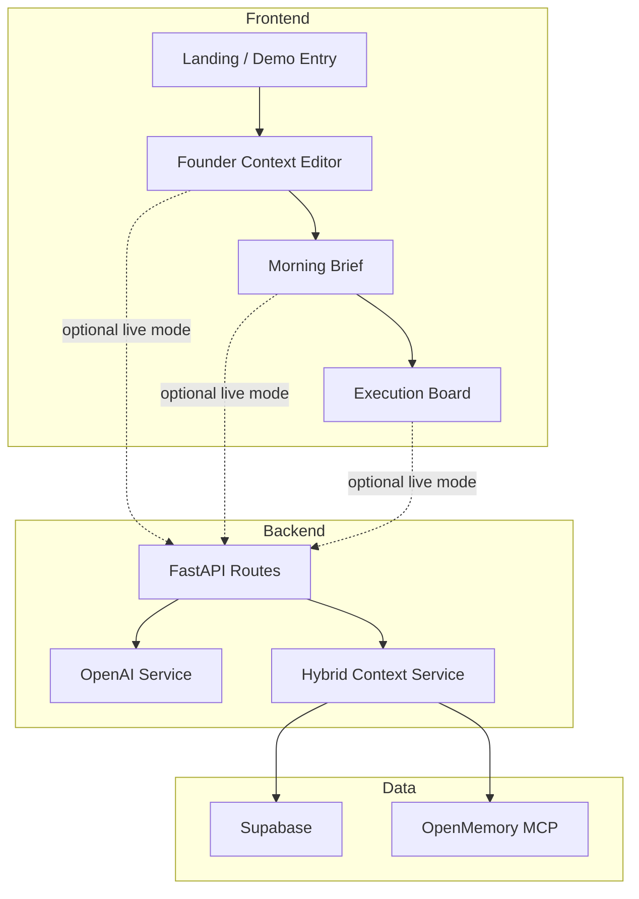

# Daily Brief Architecture

## Product Shape

Daily Brief is built around one opinionated founder workflow:

1. capture founder context
2. generate a morning brief with rationale
3. approve the plan into execution
4. learn from what actually happened

The public repo defaults to a seeded demo mode so reviewers can understand the value immediately.

## Runtime Modes

### Demo-first mode

- frontend runs with seeded founder data
- no credentials are required
- best for public reviewers, hackathon judges, and fast product understanding

### Live integration mode

- FastAPI backend provides operational APIs
- Supabase stores structured operational state
- OpenMemory stores memory and pattern context
- OpenAI / Azure OpenAI generates briefs and planning artifacts

## System Diagram

## Public Repo Principles

- default to a no-secrets first experience
- keep one excellent founder workflow in focus
- make integration-dependent tests skip cleanly when services are not configured
- avoid internal planning docs, private business context, and placeholder demo behavior in the published tree
